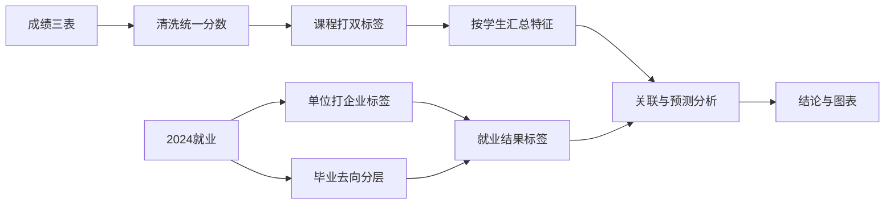

# 成绩与就业关系建模计划

> **概述**：以 20 级成绩与 2024 就业为主；单位名称用大模型批量打企业类别，课程用开课类型 + 知识领域双标签，再分析课程表现与就业去向 / 就业质量的关系。

## 任务清单

- [ ] 约定 `analysis/`、`config/`、`outputs/` 目录与依赖安装命令
- [ ] 清洗成绩三表与 2024 就业，学号对齐，分数统一
- [ ] 毕业去向分层 + 大模型对 2024 单位名称批量打企业类别标签
- [ ] 开课类型保留 + 知识领域规则打标
- [ ] 按学生汇总总体 / 类型 / 领域 / 年级特征
- [ ] 描述统计、分组对比、可解释模型与中文结论

---

## 可用数据范围（已核实）

- **可分析主样本**：20 级成绩（大一 / 大二 / 大三）∩ 2024 就业，约 **353 人**，学号基本对齐。
- **暂不纳入建模**：2023 就业（基本是 19 级），本地没有对应成绩。
- **就业表限制**：只有毕业去向、单位名称等，**没有薪资**；“质量”用 **企业类别 + 毕业去向** 共同刻画。
- **成绩注意**：成绩有数字分和“优秀 / 良好 / 中等…”等级分，需先统一换算；大三人均约 4～5 门课，远少于大一 / 大二，建模时单独处理权重，避免大三“虚高优秀率”带偏。
- **就业文件格式**：`data/2023年就业数据.xls`、`data/2024年就业数据.xls` 实际是 HTML 表格，应用网页表格方式读取（需安装 `lxml` 或 `html5lib`）。

## 分析目标

回答：哪些课程类型 / 知识领域表现更好的学生，更容易进入更高质量去向（如国企 / 大型民企 / 军工、协议就业），以及通识、重修等与就业结果的关系。

## 总体流程



## 1. 数据清洗与对齐

新建分析目录（如 `analysis/`），用 `stu_da` 环境跑脚本 / Notebook。

- 合并三份成绩表，保留学号、课程名称、开课类型、成绩、学年学期、专业等。
- 等级分统一映射（建议：优秀 = 90、良好 = 80、中等 = 70、及格 = 60、不及格 = 50；纯数字分原样保留）。
- 与 2024 就业按学号拼接；升学 / 待就业 / 入伍等单位名称特殊处理（不当普通企业分类）。
- 输出中间表：`student_grades_clean.csv`、`student_employment_labeled.csv`、`student_features.csv`。

## 2. 就业结果标签

### 毕业去向分层（示例）

- **高质量去向**：签就业协议、签劳动合同、境内升学、应征义务兵、国家 / 地方基层项目
- **关注风险**：待就业
- **自主创业**：单独一类（样本很少，报告里描述即可）

### 企业类别：DeepSeek API 对 2023 + 2024 就业单位打标

- 脚本：`analysis/label_employers_llm.py`
- 对两届就业表去重单位（约 **429** 家，重叠约 22）批量打标，再按单位名称回填。
- 固定类别：国企、大型民企、中小民企、集体所有制、外企、军工、部队/应征、高校/升学、机关事业单位/基层项目、其他/无法判断。
- 企业类额外字段：行业、最近年度总资产、净资产、年度净利润、净现金流（及年份）。
- 民企/外企额外字段：实控人姓名、实控人国籍。
- 不确定一律填「未知」，禁止编造；财务/实控人结果需人工抽查（大模型无实时工商库）。
- 升学/部队/基层项目可启发式预标；结果缓存 `outputs/employer_labels_llm_cache.json`，支持断点续跑。
- 配置：复制 `.env.example` → `.env`，填入 `DEEPSEEK_API_KEY`。

### 综合就业质量分（便于建模）

- 先按去向给基础分，再按企业类别加减分，得到有序结果（如 高 / 中 / 低 三档）。
- 同时保留“去向”“企业类别”两个单独结果，方便分项解读。

**产出**：`analysis/label_employers_llm.py` + `outputs/employer_labels_llm.csv` + `outputs/employer_labels_review.csv`（低置信度待核）。

**执行前配置（必填）**

- 在项目根目录 `.env` 中配置 API（示例字段）：`LLM_API_KEY`、`LLM_BASE_URL`、`LLM_MODEL`。
- 具体用哪家（DeepSeek / 通义 / OpenAI / 其他兼容接口）以现有密钥为准；脚本按兼容协议写，换家只改环境变量。

## 3. 课程双标签

- **标签一：开课类型**（表里已有）：主修、通识选修、板块课、重修、辅修、英语分项等。
- **标签二：知识领域**（按课程名称规则库）：如数学基础、物理、电路电子、控制与自动化、编程计算机、机械制造、轨道信号、实践实训、思政通识、外语、经管创业、其他。
- **产出**：`config/course_domain_rules.yaml` + 课程标签对照表；未覆盖课程进入人工补标清单。

## 4. 按学生汇总特征

对每位学生计算：

- 总体均分、及格率、重修门数 / 重修占比
- 按 **开课类型** 的均分、学分占比（若无学分则用门数占比）
- 按 **知识领域** 的均分、课程门数
- 分年级（大一 / 大二 / 大三）均分（大三因课少，报告中注明样本结构）
- 控制变量：专业、性别（若就业分析需要）

## 5. 分析与建模（务实、可解释）

样本量约 350，以可解释方法为主：

1. **描述统计**：各企业类别 / 去向占比；不同专业就业结构。
2. **对比**：高 / 中 / 低就业质量组在各领域、各开课类型上的均分差异。
3. **关联**：领域均分与就业质量的相关 / 列联分析。
4. **预测模型**（可选但建议做）：随机森林或逻辑回归，预测就业质量档；看特征重要性（哪些课类更有区分力）。
5. 交叉验证注意类别不平衡（待就业、军工等样本少），报告里写清局限。

## 6. 交付物

| 路径 | 说明 |
|------|------|
| `analysis/label_employers_llm.py` | 读取 2024 就业、去重大模型打标、缓存与复核表 |
| `analysis/01_load_clean.py` 或主 Notebook | 读数、清洗、课程打标、特征、建模、出图 |
| `config/course_domain_rules.yaml` | 课程知识领域规则 |
| `outputs/` | 企业 LLM 标签、特征表、图表、简短中文结论 |
| `README.md` | 如何配置 `.env`、激活 `stu_da`、复跑打标与分析 |

## 依赖安装（本地自行执行）

```bash
source ~/anaconda3/etc/profile.d/conda.sh
conda activate stu_da
pip install pandas openpyxl lxml scikit-learn matplotlib seaborn pyyaml jupyter openai python-dotenv
```

（`openai` 用于兼容各类 OpenAI 协议接口；`lxml` 用于读就业 HTML 表。）

## 默认取舍

- 主分析只用 **20 级 + 2024 就业**；2023 就业默认不进成绩模型（如需可另跑同一 LLM 打标脚本扩充对照）。
- **企业类别以大模型打标为主**，低置信度人工复核；不做工商爬虫。
- 课程仍用规则库打知识领域标签。
- 结论以“关联与可解释特征”为主，不承诺强因果。

## 数据文件说明（当前仓库）

| 文件 | 说明 |
|------|------|
| `data/20级大一成绩单.xlsx` | 20 级大一成绩 |
| `data/大二成绩单.xlsx` | 20 级大二成绩 |
| `data/大三成绩单.xlsx` | 20 级大三成绩 |
| `data/2024年就业数据.xls` | 2024 届就业（与 20 级成绩主分析对齐） |
| `data/2023年就业数据.xls` | 2023 届就业（暂无对应成绩，默认不纳入主模型） |
